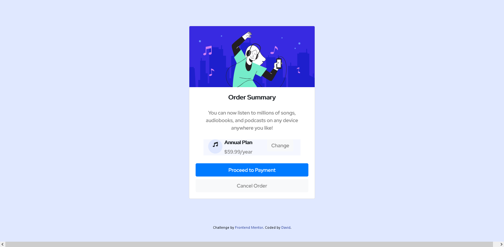

# Frontend Mentor - Order summary card solution

This is a solution to the [Order summary card challenge on Frontend Mentor](https://www.frontendmentor.io/challenges/order-summary-component-QlPmajDUj). Frontend Mentor challenges help you improve your coding skills by building realistic projects. 

## Overview

### The challenge

Users should be able to:

- See hover states for interactive elements

### Screenshot

### Links

- Solution URL: [Add solution URL here](https://your-solution-url.com)
- Live Site URL: [Add live site URL here](https://your-live-site-url.com)

## My process

### Built with

- HTML5 markup
- CSS
- Bootsrap 4

### What I learned

I still need to put more effort in planning ahead and figure out where I will start from, and how to proceed. Like start with the Html as the back bone and put in the css later
which makes the flow of the project alot more cohherent and easy I believe. I am still new to this so am still learning.

### Continued development

Am still a beginner so the road a head is still long. I stil have a lot to cover.

## Author

- Website - [Add your name here](https://www.your-site.com)
- Frontend Mentor - [@yourusername](https://www.frontendmentor.io/MURINDABGWI David/@Murindabigwi)

**Note: Delete this note and add/remove/edit lines above based on what links you'd like to share.**

